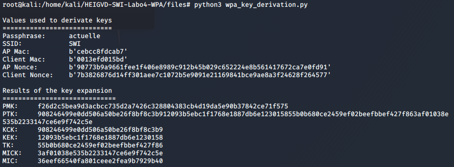
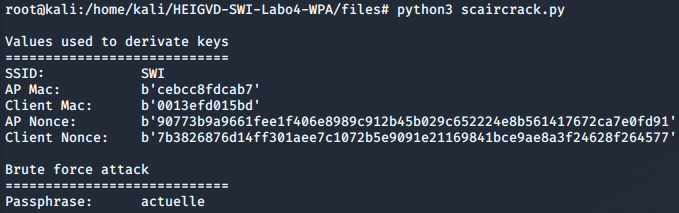

### 1. Obtention des paramètres pour la dérivation des clés WPA  

Script `files/wpa_key_derivation.py`, éxecution:

### 2. Scaircrack (aircrack basé sur Scapy)

Script `files/scaircrack.py`, éxecution:

